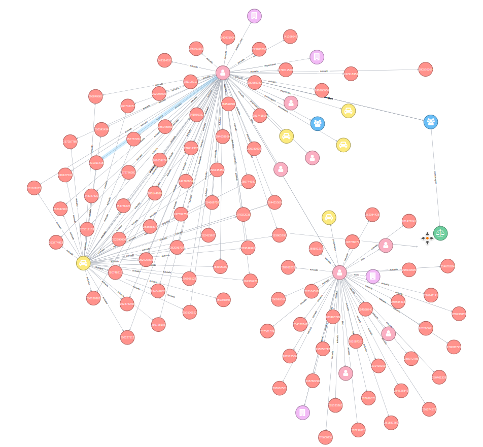

# Sinapse

Ferramenta gráfica de análise de vínculo, conectando dados oficiais da Receita, DETRAN, dentre outros órgãos.

## Objetivo
Encontrar padrões e conexões muitas vezes não evidentes entre servidores, pessoas físicas e jurídicas em contratos com o Estado, de forma gráfica e intuitiva, a fim de facilitar a análise das promotorias de justiça podendo trazer *insights* de onde pode partir uma investigação, ou prover insumos para inquéritos já em curso.

As buscas podem ser relacionadas a parentesco, relação societária, propriedades, bens, utilizando os caminhos que estas conexões fazem, que podem muitas vezes em conflito de interesse com a sociedade civil.

## Configuração e ambiente

O projeto utiliza decouple para variáveis de configuração e ambiente, é necessário utilizar um arquivo *settings.ini* ou exportar no ambiente as seguintes variáveis:

`
NEO4J_USUARIO=(usuário do banco Neo4J)  
NEO4J_SENHA=(senha do usuário)  
NEO4J_DOMINIO=(FQDN do banco Neo4J)  
MONGO_USUARIO=(usuário do banco MongoDB para log de acesso)  
MONGO_SENHA=(senha do usuário MongoDB)  
MONGO_HOST=(host do MongoDB)  
MONGO_AUTHDB=(domínio de autorização)  
SECRET=(secret key única segura)  
AUTH_MPRJ=(FQDN do autorizador web MPRJ)  
USERINFO_MPRJ=(FQDN do sistema de roles MPRJ)  
`
